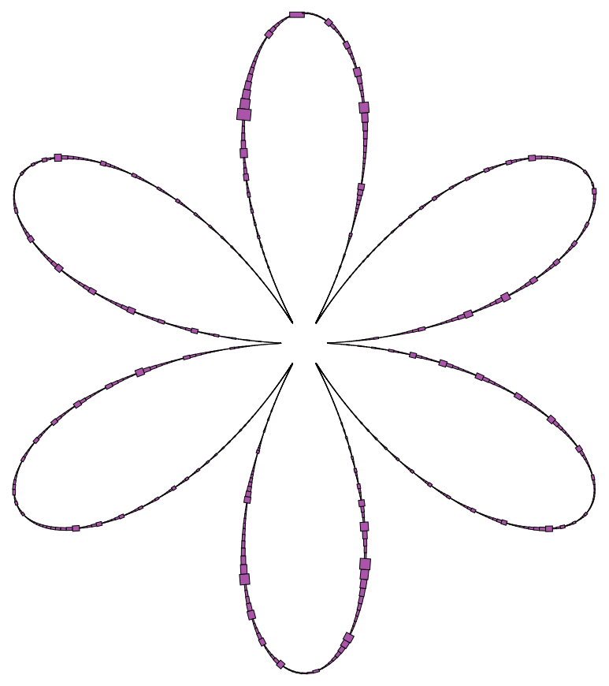

# IbexCont1

<!--  -->
@image latex doc/figs/flower_p.png "" width=0.5\textwidth

IbexCont1 is a plugin for Ibex (http://www.ibex-lib.org/) implementing a rigorous continuation of one dimensional manifolds implicitly defined by a system of equations with *n* variables and *n-1* equations. This is an implementation of the following paper: 

> Benjamin Martin, Alexandre Goldsztejn, Laurent Granvilliers and Christophe Jermann,
> Certified Parallelotope Continuation for One-Manifolds,
> SIAM Journal on Numerical Analysis, Volume 51(6), Pages 3373-3401, 2013.

The sources are under LGPL license and are available on github at https://github.com/benjam-art-in/IbexCont.

## Installation

As an Ibex plugin, IbexCont1 can be installed directly with Ibex. 

Download the last version of Ibex, and clone the git repository to the **plugins** folder of Ibex. When configuring Ibex, use the `--with-cont1` option to tell that you want to install Ibex with the IbexCont1 tool. The installation will then automatically builds the **ibexcont1** binary, and the library the sources of IbexCont1.

### Important Note

Before installing Ibex, you might want to change the values associated to the macros `TOO_SMALL` and `TOO_HIGH` in the Ibex source file **numeric/ibex\_Linear.cpp**. These macros are used to control the detection of singular matrices with floating point linear operations. The default values may trigger a premature termination of **ibexcont1** on some examples given with the sources.

## Usage

See `ibexcont1 --help`.
